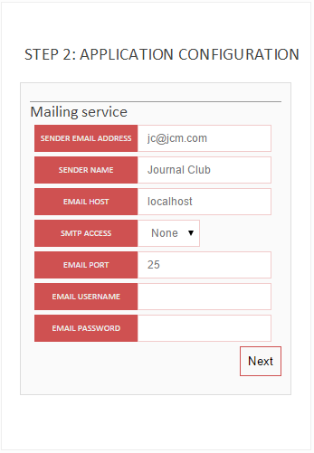

# Journal Club Manager
Version 1.4.2 | Copyright © 2014 Florian Perdreau

*Computer version*

*Mobile version*

Summary
=======
1. [Introduction](#introduction)
2. [License](#license)
3. [System Requirements](#system-requirements)
4. [Installation](#installation)
5. [Sections](#sections)
6. [Registration](#registration-procedure)

Introduction
============

*Journal Club Manager* is a web-application made to help labs and researchers in managing their journal clubs or talks.

Users who signed up to this web-application can schedule, modify or delete their presentations and add or delete files attached to their presentations.

Users can also suggest presentations (“make a wish”) that other users could present instead of them. If one chooses to make this wish true, he or she can then modify the content of this presentation, add some files, etc. and choose a date for giving his or her presentation.

*Journal Club Manager* also includes a mailing system (requires CRON jobs installed on the running server) to notify users about upcoming journal club sessions, recent news posted by the organizers on the website or the last wishes made by the other users.

Finally, Journal Club Manager comes along with an administration interface allowing administrators and organizers of the journal club to manage the different presentations, users, to export/back-up the database, to configure the application (frequency of email notifications, etc.). Particularly, they can manage the different types of sessions (e.g. a journal club session or a business meeting), the types of presentation (paper, research topic, business, methodology or guest speaker), the number of presentations per session and the chairman.

License
=======

Copyright © 2014 Florian Perdreau

*Journal Club Manager* is free software: you can redistribute it and/or modify it under the terms of the GNU Affero General Public License as published by the Free Software Foundation, either version 3 of the License, or (at your option) any later version.

*Journal Club Manager* is distributed in the hope that it will be useful, but WITHOUT ANY WARRANTY; without even the implied warranty of MERCHANTABILITY or FITNESS FOR A PARTICULAR PURPOSE. See the GNU Affero General Public License for more details.

You should have received a copy of the GNU Affero General Public License along with *Journal Club Manager*. If not, see \<http://www.gnu.org/licenses/\>.

External sources
----------------

*Journal Club Manager* also depends on external open-sources dependencies:

-   ***PHPMailer***, Copyright © 2014 Marcus Bointon, licensed under the [LGPL 2.1]: <http://www.gnu.org/licenses/lgpl-2.1.html>.

-   ***html2text***, Copyright © 2010 Jevon Wright and others, licensed under the [LGPL 2.1]: <http://www.gnu.org/licenses/lgpl-2.1.html>.

-   ***TinyMCE*** Copyright © Moxiecode Systems AB, licensed under the [LGPL 2.1]: <http://www.gnu.org/licenses/lgpl-2.1.html>.

System Requirements
===================

-   A web server running PHP 5.2 or later

-   MySQLi (5.0 or later)

-   CRON table (on Linux servers) or scheduled tasks (on Microsoft Windows servers) *\*required for email notifications*

-   SMTP server (or a Google Mail account)

Installation
============

Updating from version 1.2.1 or earlier
----------------------------------
The Journal Club Manager has sensibly changed since its very first versions. If you are running with one of these versions,
you can upgrade to the newest version of the JCM but you will need to follow a specific procedure:
1. Overwrite all the JCM's folders already present on your server EXCEPT the "uploads" folder.
2. Copy your previous config file (path_to_JCM/admin/config/config.php) to the new config folder
(path_to_JCM/config/config.php).
3. Update your JCM version by running <http://www.mydomain.com/jcm/install.php> and follow the steps described in the
next sections.
4. Congrats!

Step 1: Upload files on the server
----------------------------------

### Using GIT

Simply clone the Journal Club Manager repository (https://github.com/Fperdreau/jcm.git) at the root of your web-server.

### Using FTP

-   Upload the “jcm” folder to the root of your web-server using a FTP client (e.g. FileZilla).

-   Make sure that you have the writing permissions for all the folders and files (set folders chmod to 0755 and files chmod to 0644).

Step 2: Preparation of the database
-----------------------------------

Go to your SQL database interface (e.g. PHPmyadmin) and create a new database (if you have the rights, however, ask your admin for the name of the database). That’s it!

Step 3: Online installer
------------------------

In your favorite web-browser, go to the URL: <http://www.mydomain.com/jcm/install.php>.

### Step 0: New installation or update

The installer will automatically check for the presence of previous installations of the Journal Club Manager.

If no previous installation is found, then you will only have the option to start a new installation. This will create all the required SQL tables, folders and files.

Otherwise, you will also have the option of updating a previous installation. Do not worry, this will not overwrite your preexistent data!

### Step 1 : Database configuration

***Hostname***: Your SQL hostname (e.g.: sql.mydomain.com)

***User name***: your SQL username (the one you may use to access PHPMyAdmin).

***Password***: your SQL password (The same you are using to access PHPMyAdmin).

***Database name***: the name of the database you have created at the Step 3 of the preparation phase.

***Database prefix***: Choose a prefix that will be used to create tables in your database (e.g.: jcm).

\*Make sure the prefix you choose if not already used by other applications installed on your server.

### Step 2: Application configuration

#### Journal Club Manager – Mailing service
An (optional) feature of the *Journal Club Manager* allows to send notifications, reminders or assignment to users by 

email. To use this feature, you need to set the mailing system and particularly the SMTP host. You can either choose to use

the SMTP host of your server (if there is) or to use the one of any email provider (GMAIL, OUTLOOK, etc.).

**Send Email address:** your journal club email

**Sender Name:** Name associated to the email address

**Email host:** SMTP host address (e.g. smtp.gmail.com if you are using a GMAIL address).

**SMTP access:** Security protocol (SSL/TLS/none).

\**Note that using SSL/TLS requires that SSL PHP extension is installed on your web-server.*

**Email username:** your email username

**Email password:** your email password.

Step 3 : Creation of the admin account (only for new installation)
------------------------------------------------------------------

**Username:** choose a username for your admin account

**Password:** choose a password for your admin account

**Confirm password:** re-enter your password

**Email:** provide an email address that will be associated with the admin account.

Step 4: Delete installation files
---------------------------------

For security reasons, you must delete installation files from your web-server. Go to your FTP and:

-   Delete the “install.php” file located at the root of the “jcm” folder.

Step 5 (optional): Set plugins
------------------------------

Go to Admin>Plugins. Here you can install JCM plugins and modify their settings.

### List of built-in plugins:

**Assignment**: Automatically assigns members of the JCM (who agreed upon being assigned by settings the corresponding
option on their profile page) as speakers to the future sessions. The number of sessions to plan in advance can be set
in the plugin's settings.

**Groups**: Automatically creates groups of users based on the number of presentations scheduled for the upcoming session.
Users will be notified by email about their group's information. If the different groups are meeting in different rooms,
then the rooms can be specified in the plugin's settings (rooms must be comma-separated).

Step 6 (optional): Set automatic scheduled tasks (e.g. email notification)
---------------------------------------------------------------
Journal Club Manager relies on scheduled tasks in order to automatically send notifications, reminders or assignments by email,
or simply to backup files and database.

In order to do so, you need to set CRON jobs on your server (if your server is running on Linux) or scheduled tasks (if it’s running on MS Windows) pointing
to the PHP script 'run.php' located in the 'jcm/cronjobs' folder and to make it run every hour.

Here are tutorials to automatically run PHP file:

-   on MS Windows: <https://www.drupal.org/node/31506>

-   on Linux: <http://www.thegeekstuff.com/2011/07/php-cron-job/>

Once done, scheduled tasks can be managed from the Journal Club Manager (Admin>Scheduled Tasks).

From there, you can  install/uninstall, activate/deactivate tasks, modify their running time and options.

### List of built-in scheduled tasks:
**Mailing:** send weekly digest including the last news, details about the upcoming session, the list of the future
sessions and the list of the newest wishes.

**Notification**: Send list of last submissions by email.

**Reminder**: send reminder for the upcoming session.

**SpeakerAssignment**: automatically assigned speakers to each presentation by pseudo-randomly picking up one organizer.
The simple rule is that all organizers must have been a chair once for this particular session type (e.g. journal club,
group meeting, etc.) before an organizer can be selected again as a chair.

**MakeGroup**: Split users into groups for one session (1 group per presentation)

**DbBackup.php**: do a backup copy of the database and save it into a .sql file that can be found in “jcm/backup/mysql” folder.

**FullBackup**: do a backup copy of the database and of all the files and store it in an archive that can be found in
“jcm/backup/complete” folder.

**MailSender**: Checks whether all emails have been sent and sends them otherwise. It also cleans the mailing database
by deleting the oldest emails. The number of days of email storage can be defined in the task's settings (default is 10 days).

Sections
========

Submission
-----------

Accessible from the submission menu on the Home page.

### Submit a new publication

Select a publication type :

-   Paper: a published article

-   Research: your own research

-   Methodology: a methodology topic

-   Guest: a guest speaker.

**Speaker:** Name of the invited speaker (you do not need to fill this field if you are presenting).

**Date:** Choose a date for your presentation (only available dates are selectable).

**Title:** submission title

**Abstract:** submission abstract (2000 characters maximum)

**Authors:** Authors of the article or of the research.

**File:** pdf of the article, or slides, etc.

### Suggest a paper:

**Title:** Article’s title

**Abstract:** Article’s abstract

**Authors:** Name of the authors

**File:** PDF of the article.

### Select a paper from the wish list

**Choose a wish:** select a paper from the wish list (the list may be empty if no papers have been suggested yet).

Check that all the fields are properly filled in and choose a date for your presentation.

Archives
--------

Here, you can find all the previous presentations and download the associated files. Archives can be filtered by year.

Contact
-------

Here you can find information relative to the journal club (address, time, map) and contact the organizers by email.

My profile
----------

Every user can access his/her own profile page and manage his/her account and submissions.

Admin interface
---------------
This interface is only accessible to admins and organizers.

### Settings (requires admin level)

Here are all configurable settings of the website

#### Site parameters:

**Status:** Turn the application on or off.

**Allowed file types:** Types of files than can be uploaded by users (comma-separated).

**Maximum file size:** Maximum size of uploads (in KB)

#### Lab Information

Here you may precise your lab’s name and address.

**Google Map’s URL (to show your location on the Contact page):**

1.  Go to Google Map website and search for your location.

2.  Still on the Google Map website, look for the settings icon at the bottom right of the page (the little gray wheel), click on it and go to “Share or integrate the map”, then “Integrate the map”.

1.  Choose the “Small size” and copy the address (as shown below). Then only paste the actual url starting with https://www.google.com/maps.... (\*without the HTML tags) to the Google Map’s URL field of the Journal Club Manager.

#### Email host information

Please, refer to the 3rd installation step above.

### Users

Here you can change users’ status (admin/organizer/member), deactivate, activate or delete users’ account.

### Mailing

Here you can send an email notification to the mailing list.

### Posts

Here you can add/edit news and choose whether they should appear on the home page.

### Sessions

Here you can manage the journal club sessions, change their type, time, etc.

#### Journal Club parameters

**Room:** Room of the journal club

**Day:** Day of the journal club.

**Time (from/to):** set starting and ending time of the JC session.

**Presentation/session:** maximum number of presentations per session.

#### Session/Presentation

Here, you can set the default type of session and add or delete types of sessions and presentations.

#### Manage sessions

Here, you can manage the sessions individually: modify the type, time or speakers.

### Pages

From this section, you can set access levels to the different parts of the Journal Club Manager and modify their meta-data.

Registration procedure
======================

1.  The new user must fill up all the fields (First name, last name, username, password, email, academic position)

2.  An email is sent to the admin/organizers for verification (click on authorize or deny accordingly)

3.  Finally, the user receives a confirmation email if his/her registration has been confirmed.

